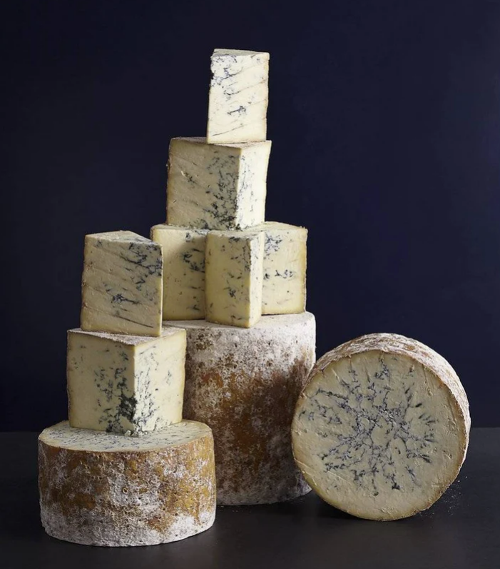

Bleu 
====================== 
Buttermilk Bleu Cheese (Roth)
----------------- 
.. image:: cheesepics/Roth_Product_ButtermilkBlue_4oz-785x690.png 
        :align: right 
        :height: 200px 

- **Origin**: Wisconsin
- **Milk**: Cow
- **Purchase location**: Giant
- **Purchase date**: 05/28/22
- **Julie's comments**: Salty, stinky, funky, creamy crumbly white & blue-grey cheese with no rind. Usually not my thing, but this is pretty good with savory foods, less salty chips (cheese itself very salty)  **2.34/5**
- **Andrew's comments**: Salty, funky, creamier than most bleu. Tasty in food (on buffalo chik patties, in stirfry), but ok solo or with chips too. Gets kind of old though, don't want too much of it.  **2.3/5**
- **Thanks to Barb & Rob Necarsulmer for this cheese!**

WFM Colston Basset Stilton (Neal's Yard)
----------------- 

- **Origin**: England
- **Milk**: Cow
- **Purchase location**: Whole Foods
- **Purchase date**: 08/16/22
- **Julie's comments**: It's blue! Or rather tan & crumbly, streaked with grayish blue lines. Very salty, funky & staticky, especially in the very blue parts. Non-blue parts are salty, buttery, melt on your tongue. Not my fave, but not bad for bleu cheese.  **2.06/5**
- **Andrew's comments**: Super buttery & smooth compared to other Bleus. Salty & funky but not overwhelming. Super tasty, I really like it, & not huge Bleu fan generally. Nice with buffalo "chicken", probably great on a burger.  **4.1/5**

