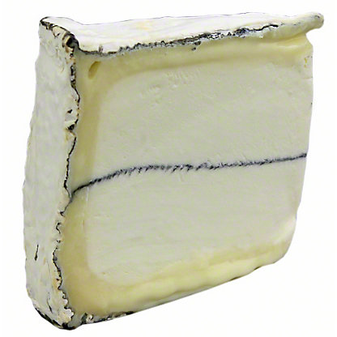

California 
====================== 
Humboldt Fog (Cypress Grove)
----------------- 

- **Style**: Other
- **Milk**: Goat
- **Purchase location**: Wegmans
- **Purchase date**: 12/25/21
- **Julie's comments**: Funky, stinky, smokey-ish cheese. Staticky after taste. Creamy center with thick, white/green rind, salty. Liked on day 1, but less so on day 2. I am conflicted. Would probably like more on a burger or something.  **3.2/5**
- **Andrew's comments**: Very soft and creamy, funky taste, bleu-ish flavor. Interesting texture, different parts are gooey/chewy. Similar to Leonara, but not as good.  **3.5/5**
- **Thanks to Barb & Rob Necarsulmer for this cheese!**

