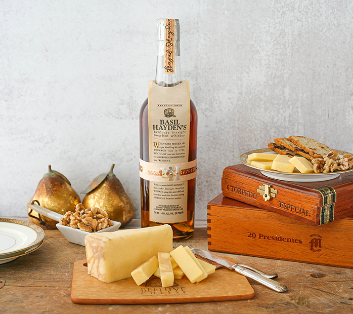
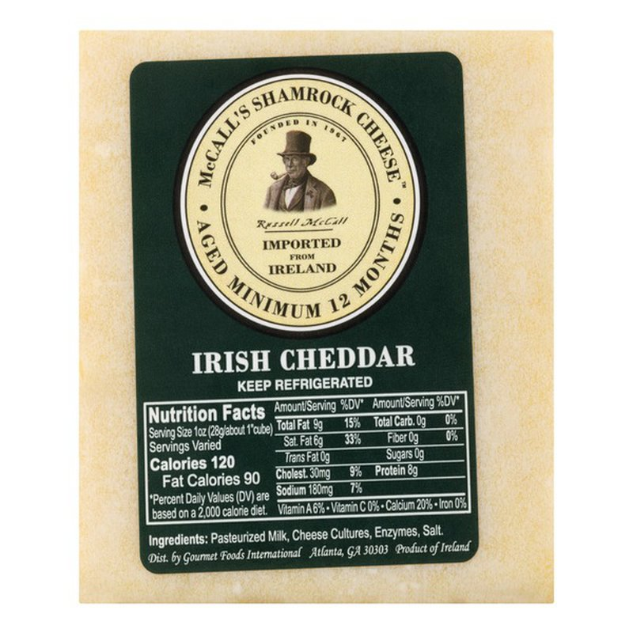

Cheddar 
====================== 
2 Year Extra Sharp Cheddar (Grafton Village)
----------------- 
.. image:: cheesepics/GraftonCheese_2YearCheddar_wPKG_Final_lg.png 
        :align: right 
        :height: 200px 

- **Origin**: Vermont
- **Milk**: Cow
- **Purchase location**: Weaver Street
- **Purchase date**: 02/20/22
- **Julie's comments**: Raw milk Vermont Cheddar. Off-white, crumbly, extra sharp chaddar that is snackable AF. Creamy when melted, with salty and mildly earthy later notes; a crowd pleaser. Great with chips & salsa, beans (?), also bourbon, maybe a white or fruitier wine.  **3.01/5**
- **Andrew's comments**: Sharp but not overbearing, & quite creamy as well. Medium texture, crumbly, "fudgey". Note the most unique, but gotta like a nice cheddar. Does make me long for the High Plains Cheddar though.  **3.2/5**

Cheddar Infused with Basil Hayden's Bourbon (Beehive Cheese)
----------------- 

- **Origin**: Utah
- **Milk**: Cow
- **Purchase location**: Harris Teater
- **Purchase date**: 02/23/22
- **Julie's comments**: Tan firm cheese, no rind. Caramel notes upfront, with a mild salty/acidic tang later, melts well. Tastes like a mild cheddar with a hint of booze. Best with bourbon, meh alone.  **1.98/5**
- **Andrew's comments**: Fairly mild, a bit sharp like white cheddar. I don't really taste the bourbon, except maybe slightly at rind. Very forgettable honestly.  **1.3/5**

Dubliner (Kerrygold)
----------------- 
.. image:: cheesepics/large_deb1d16c-fdcd-4554-b9f5-d1ce935b7f0a.jpg 
        :align: right 
        :height: 200px 

- **Origin**: Ireland
- **Milk**: Cow
- **Purchase location**: Ingles
- **Purchase date**: 05/08/21
- **Julie's comments**: Pale/white, semihard, aged. Cheddar-like. Good melted. Good general cheese. Sharp, pairs with many things. Not very exciting, but tasty. Note: Do not remember well.  **3.3/5**
- **Andrew's comments**: Don't remember well, but I think I like it? Paired great with chips and salsa.  **3.5/5**

High Plains Cheddar (Murray's Cheese)
----------------- 
.. image:: cheesepics/20615300000.0.jpg 
        :align: right 
        :height: 200px 

- **Origin**: Iowa
- **Milk**: Cow
- **Purchase location**: Murray's Cheese
- **Purchase date**: 01/14/22
- **Julie's comments**: Caramel, nutty flavors up front, a bit of cream and salt afterward. Pairs very well with bourbon. Creamy & smooth with a large crumble, melts in the mouth. I could eat this all day.  **4.82/5**
- **Andrew's comments**: Very unique flavor - definitely a cheddar (medium sharp), but also sweet & nutty. Very delicious. Pairs great with bourbon, as Murray's suggests. Great alone, I expect would make great burger or grilled cheese too.  **4.8/5**
- **Thanks to Tim & Abigail Necarsulmer for this cheese!**

Irish Cheddar (McCall's Shamrock Cheese)
----------------- 

- **Origin**: Ireland
- **Milk**: Cow
- **Purchase location**: Harris Teater
- **Purchase date**: 09/01/21
- **Julie's comments**: Sharp, aged, creamy white cheddar, kinda tangy. Crumbly sort of, melts in chunks, good with spice, would be good with spreads or dried fruit maybe. Pretty average cheese.  **3.05/5**
- **Andrew's comments**: Solid white cheddar, sharp & nice crumbly texture. Above average but only just. Nice with salty chips.  **3.0/5**

Keens Farmhouse Cheddar (Neals Yard)
----------------- 
.. image:: cheesepics/nealsfarmhouse.png 
        :align: right 
        :height: 200px 

- **Origin**: England
- **Milk**: Cow
- **Purchase location**: Whole Foods
- **Purchase date**: 05/15/22
- **Julie's comments**: Looks like a standard white cheddar, but I would not have guessed it was a cheddar by taste. Smooth, gummy texture. Not very crumbly, salty and tangy flavor, with a sharp sour feeling that lingers at the end. At first I really didn't like it, but it has grown on me. Pair with crackers or a jam (not a spicy one)...hmm...  **2.29/5**
- **Andrew's comments**: Not the most cheddary, semi-sharp. Kind of tangy and a bit of licorice? And a bit of almost fermented taste that reminds me of the Caciacavallo. Smooth texture with small grains. Overall interesting but not the best.  **2.1/5**

Smoked Cheddar (Ayr-Back Farms)
----------------- 
- **Origin**: Pennsylvania
- **Milk**: Cow
- **Purchase location**: Pocopson Meadow Farm store
- **Purchase date**: 12/25/21
- **Julie's comments**: Subtle smoky flavor on top of a mildly sharp cheddar. Creamy, fatty, a bit crumbly. Seems to melt well. Extra nudge on rating for freshness.  **4.01/5**
- **Andrew's comments**: Soft & slightly chewy, slightly crumbly. Pretty mild, somewhat sharp & smoky. Gets extra points based on ambiance & getting to see farm animals. Would probably make a great quesodilla.  **3.0/5**

Ten Year Aged Cheddar (Hook's Cheese Company)
----------------- 
.. image:: cheesepics/hooks-cheese-company-cheddar-aged-10-year-1S-1401.jpg 
        :align: right 
        :height: 200px 

- **Origin**: Wisconsin
- **Milk**: Cow
- **Purchase location**: Fromagination
- **Purchase date**: 07/01/21
- **Julie's comments**: Orange in color, firm. Creamy upon putting in mouth, melts well. Sharp, nutty, salty. Smooth, delicious, incredible. Hard to rate…  **4.85/5**
- **Andrew's comments**: So creamy, literally melts in your mouth. Goes through a couple different flavor stages, all delicious. Sharp but not overload. Definitely one of the best cheeses I've had.  **4.9/5**
- **Thanks to Allie Bukowski & Glenn Palmer for this cheese!**

Vermont Seriously Sharp White Cheddar (Cabot)
----------------- 
.. image:: cheesepics/seriouslysharpcheddar.png 
        :align: right 
        :height: 200px 

- **Origin**: Vermont
- **Milk**: Cow
- **Purchase location**: Weaver Street
- **Purchase date**: 04/15/22
- **Julie's comments**: This is not seriously sharp, unless seriously is less sharp than extra, which seems wrong. Mild cheddar, salty, chewy, kinda creamy. Fine/good on burger or sandwich. Meh alone.  **2.0/5**
- **Andrew's comments**: Semi-creamy, semi-sharp, medium texture. Pretty generic, though very snackable on chips, could eat a lot.  **2.0/5**

XXX Sharp Cheddar (Yancey's Fancy)
----------------- 
.. image:: cheesepics/yanceysxxx.png 
        :align: right 
        :height: 200px 

- **Origin**: New York
- **Milk**: Cow
- **Purchase location**: Harris Teater
- **Purchase date**: 05/09/22
- **Julie's comments**: White, firm block of cheddar. Pretty standard sharp cheddar - creamy, salty, a bit of tang. Maybe deserves one of the Xs in XXX sharp. Good with gams/relish. Very snackable, easy to eat.  **3.12/5**
- **Andrew's comments**: Pretty standard white cheddar, agreed. Salty, sharp, with a bit of sour. Even standard cheddar is tasty. Very snackable, especially with spicy relish. Could eat a lot of it.  **2.6/5**

