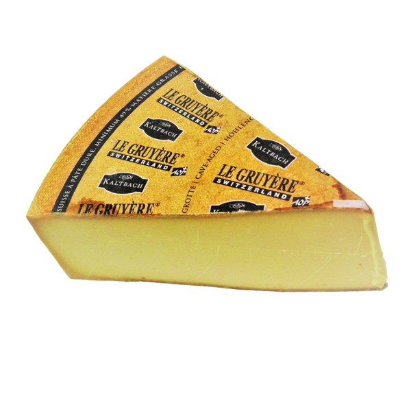

Gruyere 
====================== 
Cave Aged Gruyere (Unknown)
----------------- 

- **Origin**: Switzerland
- **Milk**: Cow
- **Purchase location**: Weaver Street
- **Purchase date**: 07/10/22
- **Julie's comments**: Tan cheese, firm, with a brown crusty, crumbly rind. Salty, tangy, grassy, a bit cattle-y? In a nice way. Like comte and also a little cheddar vibes, rind is funky. Creamy, gummy texture. Would be good with jam or pepper jelly.  **2.95/5**
- **Andrew's comments**: Barny, tangy flavor, reminds me of raclette (the cheese, not act), or even fondue flavor. Not my favorite. Texture is a bit gummy, flavor sticks in mouth a while.  **1.6/5**

