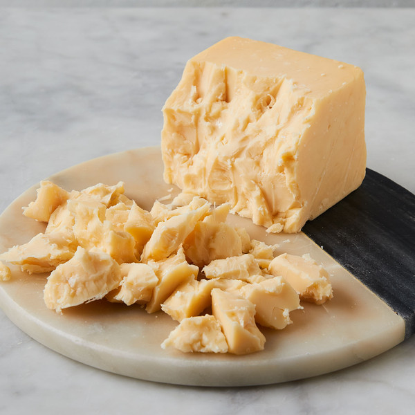

Iowa 
====================== 
High Plains Cheddar (Murray's Cheese)
----------------- 

- **Style**: Cheddar
- **Milk**: Cow
- **Purchase location**: Murray's Cheese
- **Purchase date**: 01/14/22
- **Julie's comments**: Caramel, nutty flavors up front, a bit of cream and salt afterward. Pairs very well with bourbon. Creamy & smooth with a large crumble, melts in the mouth. I could eat this all day.  **4.82/5**
- **Andrew's comments**: Very unique flavor - definitely a cheddar (medium sharp), but also sweet & nutty. Very delicious. Pairs great with bourbon, as Murray's suggests. Great alone, I expect would make great burger or grilled cheese too.  **4.8/5**
- **Thanks to Tim & Abigail Necarsulmer for this cheese!**

