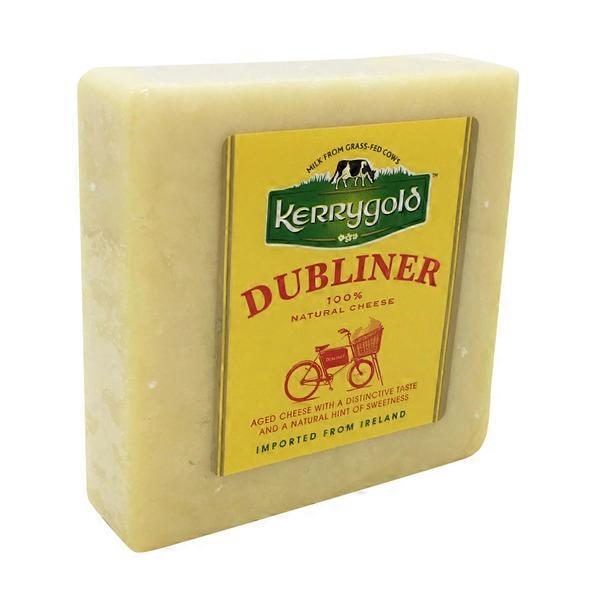

Ireland 
====================== 
Dubliner (Kerrygold)
----------------- 

- **Style**: Cheddar
- **Milk**: Cow
- **Purchase location**: Ingles
- **Purchase date**: 05/08/21
- **Julie's comments**: Pale/white, semihard, aged. Cheddar-like. Good melted. Good general cheese. Sharp, pairs with many things. Not very exciting, but tasty. Note: Do not remember well.  **3.3/5**
- **Andrew's comments**: Don't remember well, but I think I like it? Paired great with chips and salsa.  **3.5/5**

Irish Cheddar (McCall's Shamrock Cheese)
----------------- 
.. image:: cheesepics/large_f4e9325d-a9b2-4861-9b58-8fb30c47bcc0.jpg 
        :align: right 
        :height: 200px 

- **Style**: Cheddar
- **Milk**: Cow
- **Purchase location**: Harris Teeter
- **Purchase date**: 09/01/21
- **Julie's comments**: Sharp, aged, creamy white cheddar, kinda tangy. Crumbly sort of, melts in chunks, good with spice, would be good with spreads or dried fruit maybe. Pretty average cheese.  **3.05/5**
- **Andrew's comments**: Solid white cheddar, sharp & nice crumbly texture. Above average but only just. Nice with salty chips.  **3.0/5**

