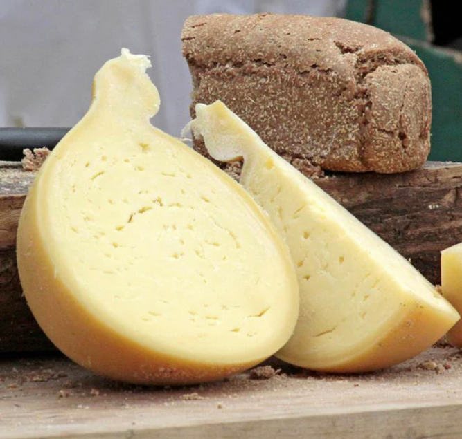
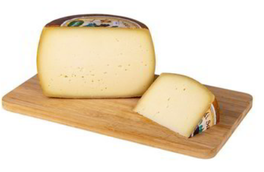

Italy 
====================== 
Caciacavallo (Julia's uncle)
----------------- 

- **Style**: Caciacavallo
- **Milk**: Unknown
- **Purchase location**: Julia's Uncle
- **Purchase date**: 01/09/22
- **Julie's comments**: Shaped like a bell with a top knob thing. Tan with a layered waxy rind. Salty, dry, umami. Tastes remarkably like salami - aged, meaty. Most unique cheese thus far for me - addictive.   **4.39/5**
- **Andrew's comments**: Honestly such a strange cheese… very confusing taste, but it has grown on me and I love it. Salty and meaty, texture a bit like jerky especially near rind. Would probably go great with charcuterie if that's your thing. Also kind of sour, vaguely like kimchi? Extremely snackable, especially with chip to take the edge off. Very unique.  **4.69/5**
- **Thanks to Giulia Fragola for this cheese!**

Fontina Val D'Aosta (Mitica)
----------------- 
.. image:: cheesepics/daosta.png 
        :align: right 
        :height: 200px 

- **Style**: Other
- **Milk**: Cow
- **Purchase location**: Whole Foods
- **Purchase date**: 05/02/22
- **Julie's comments**: Tan semi firm smooth-looking cheese with a patterned thin rind - gradient of firmness toward rind. Interior is smooth, a bit gummy, with woodsy, nutty, creamy, mild flavor. Exterior is very funky, tangy, almost bitter. Ages fine.  **2.04/5**
- **Andrew's comments**: Very subtle - nice & interesting flavor, but you have to pay attention. Nutty, buttery, semi-funky especially at rind. Very pleasant texture. Semi-hard, with gradient, and particley rind. Bit bitter as aged.  **2.8/5**

Pecorino Moro di Sardegna (Tigros)
----------------- 

- **Style**: Pecorino
- **Milk**: Sheep
- **Purchase location**: Unknown
- **Purchase date**: 01/09/22
- **Julie's comments**: This one has some funk! Salty, umami, with a lot of creamy and a bit of tang. Firm, soft texture (not crumbly) that melts in the mouth. Original taste, different from other pecorinos. Polarizing, I go back and forth.  **2.4/5**
- **Andrew's comments**: A bit funky, nutty, umami. Medium firmness, nice texture with harder rind. I keep going back and forth on this one bite to bite. Addendum: After another couple of days I'm back to liking this less.  **2.2/5**
- **Thanks to Giulia Fragola for this cheese!**

Pecorino Romano   (Murray's Cheese)
----------------- 
.. image:: cheesepics/pecorinoromano.png 
        :align: right 
        :height: 200px 

- **Style**: Pecorino
- **Milk**: Sheep
- **Purchase location**: Murray's Cheese
- **Purchase date**: 01/14/22
- **Julie's comments**: So many Pecorinos! Firm, off-white cheese. Small crumble to it. Very salty tey also creamy, needs balance. Good but not as tasty as Pecorino Toscano. A simpler flavor, seems to have salt crystals in it.  **2.6/5**
- **Andrew's comments**: Very salty & umami, more oily than creamy. Seems like it would be great over pasta, especially pesto. A bit too salty solo.  **2.6/5**
- **Thanks to Tim & Abigail Necarsulmer for this cheese!**

Pecorino Romano DOP (Tigros)
----------------- 
.. image:: cheesepics/pecorinoromano.png 
        :align: right 
        :height: 200px 

- **Style**: Pecorino
- **Milk**: Sheep  
- **Purchase location**: Unknown
- **Purchase date**: 01/09/22
- **Julie's comments**: Oh golly gee this is amazing cheese. Hard, aged cheese with a large crumbly texture. Nutty, rich, creamy and also salty and buttery. Great alone, on a tomato sauce dish too… yummm  **4.79/5**
- **Andrew's comments**: This cheese is so good. Like what Parmesan wants to be after its 10,000 hours. Creamy, salty, nutty, umami. Hard & crumbly but pleasant mouth feel.  **4.8/5**
- **Thanks to Giulia Fragola for this cheese!**

Pichin (Lou Bergier)
----------------- 
.. image:: cheesepics/Lou-Bergier-Pichin-2.jpg 
        :align: right 
        :height: 200px 

- **Style**: Other
- **Milk**: Cow
- **Purchase location**: Weaver Street
- **Purchase date**: 03/07/22
- **Julie's comments**: Raw cow milk, sea salt, thistle flowers. A unique cheese - white, firm, tan waxy rind. Very mild tangy funk up front, then salty, some grassy butter taste. Tasted some floral notes when first opened, but not by day 3. Quite pleasing.  **3.92/5**
- **Andrew's comments**: I go back & forth on this one, not sure if it's different parts of the cheese, or just different nights & moods. At its best, it's buttery/creamy, tangy, unique flavor. Nice semi-hard texture. At less inspired moments it reminds me of generic white cheddar.  **3.3/5**

Provolone Picante (Auricchio)
----------------- 
.. image:: cheesepics/AURICCHIO-PROVOLONE.jpg 
        :align: right 
        :height: 200px 

- **Style**: Provolone
- **Milk**: Cow
- **Purchase location**: Unknown
- **Purchase date**: 01/09/22
- **Julie's comments**: Sharp, salty, tangy, SHARP cheese, with nutty undertones. Great with a zesty pasta sauce and an Italian red wine. Firm, dense, and layered/stringy texture with flavor that lingers. Stands well alone.  **3.96/5**
- **Andrew's comments**: Sharp and salty, tastes a bit like the Pecorino Romano I think, but more subtle. Crumbly texture, slightly grainy. Pretty good, but not super memorable.  **2.6/5**
- **Thanks to Giulia Fragola for this cheese!**

Quadrello di Bufala (Quattro Portoni)
----------------- 

- **Style**: Other
- **Milk**: Water buffalo
- **Purchase location**: Whole Foods
- **Purchase date**: 03/14/22
- **Julie's comments**: Creamy, soft, salty cheese with a salty, gritty rind. A bit hunky, but not stinky at all. Goes great on crackers (needs a crisp), with a jam or preserves. This cheese grew on me.  **4.12/5**
- **Andrew's comments**: Brie-like texture, very creamy, fairly mild but has a nice salty funk if you pay attention, especially at rind, with interesting gritty texture. Grew on me too, maybe the rind at back was a bit more flavorful.  **3.8/5**

Taleggio (Unknown)
----------------- 
.. image:: cheesepics/taleggioweaver.png 
        :align: right 
        :height: 200px 

- **Style**: Taleggio
- **Milk**: Cow
- **Purchase location**: Weaver Street
- **Purchase date**: 01/08/22
- **Julie's comments**: A creamy, funky, salty cheese with a soft interior and crusty exterior. Has a special blue-green "cat fur" (or something) mold on outside. Grew on me but not my favorite. Maybe needs a fig jam or something?  **2.5/5**
- **Andrew's comments**: Very creamy, soft buttery texture. A bit of funk but fairly subtle. Really nice on salty chip.  **3.9/5**

Taleggio DOP (Unknown)
----------------- 
.. image:: cheesepics/taleggioweaver.png 
        :align: right 
        :height: 200px 

- **Style**: Taleggio
- **Milk**: Cow
- **Purchase location**: Unknown
- **Purchase date**: 01/09/22
- **Julie's comments**: Woah! This is tasty and very different from other Taleggio. Unique cheese. Very creamy, a bit buttery, tangy and salty (maybe a bit too salty). Firmer than Brie but similar texture. Excellent with red wine and a simple cracker.  **4.57/5**
- **Andrew's comments**: Quite rich and creamy, soft but "sticker" texture than other Taleggio. I wish it had a firmer rind like the other. Tastes fairly funky and quite salty. Feels a bit one dimensional compared to the other Taleggio.  **2.7/5**
- **Thanks to Giulia Fragola for this cheese!**

Ubriacone (Mitica)
----------------- 
.. image:: cheesepics/ubriacone.png 
        :align: right 
        :height: 200px 

- **Style**: Flavored
- **Milk**: Cow
- **Purchase location**: Whole Foods
- **Purchase date**: 04/06/22
- **Julie's comments**: Pale off-white firm cheese with a dark purple rind that makes drilled holes into center. Aged, nutty, slightly sharp, slightly caramely? Like cheddar + goat (subtle tang). Rind tastes like wine! Quite tasty. Dangerously snackable.  **4.08/5**
- **Andrew's comments**: Center is very creamy, semi sharp, semi nutty. Fairly soft, semi gummy texture. Outer rind more firm, stronger nutty flavors and a hint of sour flavor. Maybe siney subtly? I like outer part better, inner a bit rich for me.  **3.8/5**

Valtellina Casera (Unknown)
----------------- 
.. image:: cheesepics/69ab8b3e427a6bd756e47275c6c8a368.jpg 
        :align: right 
        :height: 200px 

- **Style**: Other
- **Milk**: Cow
- **Purchase location**: Harris Teeter
- **Purchase date**: 04/20/22
- **Julie's comments**: Pale, off-white hard aged cheese with some white crystals through interior. Very nutty, a bit woodsy, with a slight caramel after taste, kind of Pecorino-like. Very snackable, will dry out with time. *Note: rated whilst COVID infected, taste mostly unaffected  **3.74/5**
- **Andrew's comments**: Interior of cheese is salty, umami, a bit sour/citrusy & nutty. Between a Pecorino Romano & Caciacavallo. Near the rind is hard & rubbery & less flavorful, maybe ours dried out. Rated 3.6 interior, 1.5 exterior.  **2.6/5**

