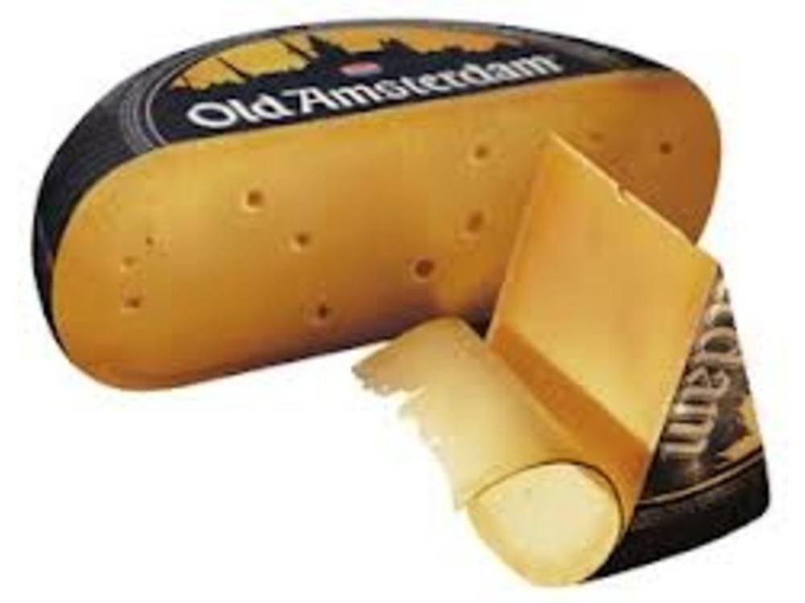

Netherlands 
====================== 
16 Month Gouda (might be 18 or 36… those seem to be two options) (Clarina)
----------------- 

- **Style**: Gouda
- **Milk**: Cow
- **Purchase location**: Whole Foods
- **Purchase date**: 04/03/22
- **Julie's comments**: Yum! Hard tan cheese with white crystals scattered through it, & an orange waxy rind. Tastes quite sharp & aged, like a Pecorino, but has nutty & caramely notes like a Gouda. Dries out a bit with time, but still tasty. So snackable.  **4.57/5**
- **Andrew's comments**: Quite aged, hard cheese with interesting crystals texture inside. Very caramely, semi sharp, nutty, & hint of orange. Tasty but a bit rich for me to have more than a couple pieces. Dried out, eat fast.  **3.8/5**

Aged Gouda (Old Amsterdam)
----------------- 

- **Style**: Gouda
- **Milk**: Cow
- **Purchase location**: Weaver Street
- **Purchase date**: 02/20/22
- **Julie's comments**: Tan-orange color with brown waxy rind. Dries out with time. Pretty mild flavor - sharper toward the rind (a bit cheddar like) and then a nutty, mild caramel flavor in the middle. Good with a light red wine, eg Pacific Redwood Organic Pinot 2020.   **3.1/5**
- **Andrew's comments**: Quite tasty, sweet & caramely at first, with more sharp cheddary flavor later. A bit firmer than most Goudas which is nice. Very snackable, nice with salty chip, good pairing with our Pinot Noir with spice flavors.  **3.7/5**

Boo-da Gouda (Spring Koe)
----------------- 
.. image:: cheesepics/boodagouda.png 
        :align: right 
        :height: 200px 

- **Style**: Gouda
- **Milk**: Cow
- **Purchase location**: Whole Foods
- **Purchase date**: 10/30/21
- **Julie's comments**: Cantaloupe-colored with black rind, hard/firm. Mix of cheddar & gouda taste, not remarkable but good, melts well. Creamyish, sharp deep flavor, good with spice.  **2.81/5**
- **Andrew's comments**: Agreed, gouda-cheddar hybrid, moderately sharp. Nice semi-crumbly mouthfeel. Very nice with a salty chip, super snackable.  **3.2/5**

Estate Gouda (Murray's Cheese)
----------------- 

- **Style**: Gouda
- **Milk**: Cow
- **Purchase location**: Murray's Cheese
- **Purchase date**: 01/14/22
- **Julie's comments**: Pale yellow firm cheese that gets slightly darker at the rind - brown waxy rind. Nutty, caramely, woodsy flavor. Melts in the mouth & on a savory smoky food. Does dry out a bit with time.  **3.84/5**
- **Andrew's comments**: Firm near rind, softer & a bit less pleasant (kind of American cheesy) in terms of texture near center. Rich, earthy, "cool" taste, with caramel & nuttiness. Intersting flavor, especially closer to rind. Would give a bit higher rating near rind (4.1), and lower near center (2.5)  **3.3/5**
- **Thanks to Tim & Abigail Necarsulmer for this cheese!**

Goat Gouda (Cablanca)
----------------- 

- **Style**: Gouda
- **Milk**: Goat
- **Purchase location**: Weaver Street
- **Purchase date**: 08/21/21
- **Julie's comments**: Off white color, firm. Tangy like goat cheese, but creamy, buttery & nutty like gouda. Melts well, great alone or with most things. Purchased with Chardonnay for Becky.  **4.82/5**
- **Andrew's comments**: Great cheese, similar to white cheddar but not too sharp, more nutty. Nice goaty crumbly mouth feel.  **4.1/5**

Midnight Moon (Cypress Grove)
----------------- 

- **Style**: Gouda
- **Milk**: Goat
- **Purchase location**: Whole Foods
- **Purchase date**: 11/26/21
- **Julie's comments**: Sharp, sweet/deep & nutty goat cheese. Hard, off-white, thin rind. Great alone (I prefer alone vs on crackers). Mild yet complex flavor, goes with most things  **4.67/5**
- **Andrew's comments**: Interesting nutty flavor, somewhat Parmesany texture. I like it but nothing spectacular in my opinion (sorry J)  **3.1/5**

Midnight Moon (Cypress Grove)
----------------- 

- **Style**: Gouda
- **Milk**: Goat
- **Purchase location**: Unknown
- **Purchase date**: 05/15/22
- **Julie's comments**: Pale tan cheese with a creamy firm center that gets darker toward the black waxy rind. Nutty, creamy, slightly caramely cheese that pairs well with anything. Kind of Gouda-like, a hint of butter/oak. Very snackable.  **4.43/5**
- **Andrew's comments**: Nutty & quite milky flavored. Semi-hard, crumbly texture. I want to like this one, it seems like a nice cheese, but just doesn't do much for me, kind of boring. Sorry!  **2.4/5**
- **Thanks to Samantha Tulenko for this cheese!**

Paradiso Reserve (Beemster Cheese)
----------------- 
.. image:: cheesepics/Paradiso_Reserve_silver_014011_Wheel+w+Wedge.png 
        :align: right 
        :height: 200px 

- **Style**: Other
- **Milk**: Cow
- **Purchase location**: Wegmans
- **Purchase date**: 09/04/22
- **Julie's comments**: Firm-to-hard pale orange cheese with a wax rind. Aged cheese, nutty, salty, umami with salty crystals in the center in some bites. Tastes like a Gouda and a sharp cheddar or Manchego. Very snackable - does dry out pretty quickly though.  **3.91/5**
- **Andrew's comments**: Tasty, caramelly, nutty, and a bit tangy. Nice semi firm texture, with occassional crystals. Very snackable, but year it dries out, especially around rind.  **3.5/5**

Parrano Originale (Parrano)
----------------- 
.. image:: cheesepics/large_7b4331bc-06f8-4838-a521-bb65fe7fc096.png 
        :align: right 
        :height: 200px 

- **Style**: Other
- **Milk**: Cow
- **Purchase location**: Weaver Street
- **Purchase date**: 03/05/22
- **Julie's comments**: Tan/yellow cheese, firm, with a red & white rind. Very Gouda-like, nutty & sharp, creamy & buttery. Pretty mild & versatile. Good with crackers & jam. Quite snackable.  **3.04/5**
- **Andrew's comments**: Gouda-like at center, nutty & caramely, soft texture not my favorite, but flavor is nice though mild. Harder near rind, nicer texture. Dried out a bit, trying to remember initial impressions.  **2.7/5**

Robusto Gouda (Kaasiaggio)
----------------- 
.. image:: cheesepics/1350f13d6c2df6d7f334d5e2e93cb40a.jpg 
        :align: right 
        :height: 200px 

- **Style**: Gouda
- **Milk**: Cow
- **Purchase location**: Whole Foods
- **Purchase date**: 10/30/21
- **Julie's comments**: Tan, firm cheese with red/orange rind. Quite aged, so nutty and sharp with a mild funky after taste. Salty! Good with rackers and a spread or with salad, pasta! Better fresh, dries quickly.  **3.12/5**
- **Andrew's comments**: Hard cheese, much closer to Parmesan flavor/texture than traditional Gouda. Has crystals that look like mold (but not). Pretty forgettable honestly, middle of road.  **2.3/5**

