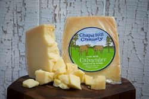

North Carolina 
====================== 
Calavander (Chapel Hill Creamery)
----------------- 

- **Style**: Asiago
- **Milk**: Cow
- **Purchase location**: Weaver Street
- **Purchase date**: 05/28/22
- **Julie's comments**: Pale orange firm cheese with a thin brown rind. Very nutty and tangy with a hint of caramel. Tastes like a Gouda and a Parmesan had a cheese baby. Creamy, versatile, snackable - I could eat a block of this. Note: rind = not tasty.  **3.09/5**
- **Andrew's comments**: Nutty & caramely, agree on Gouda/Parmesan flavor. It's supposed to be asiago style, but not great resemblance - may have been close before drying out. Kind of gummy texture, not my favorite. Inner part better than rind.  **2.7/5**

Carolina Moon (Chapel Hill Creamery)
----------------- 
.. image:: cheesepics/carolina-moon-cheese-960_640.jpg 
        :align: right 
        :height: 200px 

- **Style**: Brie-like
- **Milk**: Cow
- **Purchase location**: Carrboro Farmer's Market
- **Purchase date**: 12/11/21
- **Julie's comments**: White rind with slightly yellow soft interior. Very rich, creamy, buttery - a bit too much for me. Like a brie, but stronger, a bit more buttery & a bit of funk. I respect it, but this isn't my favorite style of cheese.  **3.06/5**
- **Andrew's comments**: Rich & buttery, a bit funky but not too much. Soft center, firmer/chewy rind. I love this cheese, I could eat a whole wheel of this and a baguette for dinner.  **4.6/5**

Herbed goat cheese log (not sure which one) (Celebrity Dairy)
----------------- 
- **Style**: Chevre
- **Milk**: Goat
- **Purchase location**: Carrboro Farmer's Market
- **Purchase date**: 11/15/21
- **Julie's comments**: Goat cheese log that is flavorful inside and out. Coated with herbs, black pepper, salt, but inside also has zest/garlic herb flavor. Creamy, crowd pleaser. Froze to save and still tastes good!  **4.1/5**
- **Andrew's comments**: So delicate & creamy & rich, the cheese melts in your mouth. Salt & herbs on outside are subtle but tasty. Good solo, on chips, on salad, etc.  **4.2/5**

Hickory Grove (Chapel Hill Creamery)
----------------- 
.. image:: cheesepics/1350f13d6c2df6d7f334d5e2e93cb40a.jpg 
        :align: right 
        :height: 200px 

- **Style**: Other
- **Milk**: Cow
- **Purchase location**: Weaver Street
- **Purchase date**: 08/21/21
- **Julie's comments**: Butter and cheddar and a leeetle brie had a hot threesome to make this fine cheese. Semi soft, pale yellow/firm rind. A bit funky but only subtly (but smells funkier). Great on crackers, with salty spread, or alone. Creamy inside.  **4.81/5**
- **Andrew's comments**: A top tier cheese to be sure. Very buttery and nice semi squishy texture, kind of like a butter & paneer baby (but better than that sounds). Great with salty tortilla chips.  **4.7/5**

Redbud (Boxcar)
----------------- 
.. image:: cheesepics/Redbud-1.jpg 
        :align: right 
        :height: 200px 

- **Style**: Other
- **Milk**: Cow + Goat
- **Purchase location**: Weaver Street
- **Purchase date**: 03/19/22
- **Julie's comments**: Pimenton rubbed & smoked cheese. Hard, yellow/tan, aged cheese with a mottled red/brown thin rind - paprika-y! Mild nutty, salty, tangy flavor in interior. Subtle smoky, woodsy, mildly funky exterior by rind. Quite snackable, a bit dry. Great with pepper jelly.  **2.89/5**
- **Andrew's comments**: Hard yellow cheese with interesting granules adding texture. Dried out a bit since we got it. Nutty, salty-sweet, & smoky/spicy (mild) after taste. Semi-funky rind. Great on its own, with chips, or with pepper jelly.  **4.3/5**

Rocket's Robiola (Boxcar)
----------------- 
.. image:: cheesepics/2017-10-american-cheese-09573-1024x683.jpg 
        :align: right 
        :height: 200px 

- **Style**: Other
- **Milk**: Cow
- **Purchase location**: Weaver Street
- **Purchase date**: 03/19/22
- **Julie's comments**: Funky AF, mild stinky cheese - gray ashy rind, creamy/gooey under rind, then soft crumbly white interior. The gooey part has brie-like flavor - tangy, funky, creamy. Center is more funky, kind of sour, earthy. Rind is deep, earthy, sooty. Good with strawberry habenero jam. Tough to rate.  **2.0/5**
- **Andrew's comments**: Truly strange & unique cheese, different flavors come in waves. Funky, stinky rind, then gooey, slimy layer, then soft chevre-like texture. Creamy Brie flavor up front, then earthier barny flavors, then smokey finish. I have to rate higher than pure enjoyment out of sheer uniqueness.  **3.7/5**

Spring Fever (Prodigal Farm)
----------------- 
- **Style**: Other
- **Milk**: Goat
- **Purchase location**: Weaver Street
- **Purchase date**: 03/26/22
- **Julie's comments**: Soft white cheese with crumbly white center, off-white creamy outer layer, & classic white textured rind. Tangy, salty chevre-like interior, then creamy buttery Brie-like outer layer. Mild funk especially in creamy part, which I like less. Has metallic after taste. Overall I like a lot, surprisingly. So good with pepper jelly.  **4.39/5**
- **Andrew's comments**: So good & unique. Super creamy, texture in between chevre & Brie. Also has tangy flavor, lemony, some bites even remind me of lemon bar (cheesecake version), but not sweet. Semi salty & nic, mild funk. Agreed about pepper jelly.  **4.85/5**

