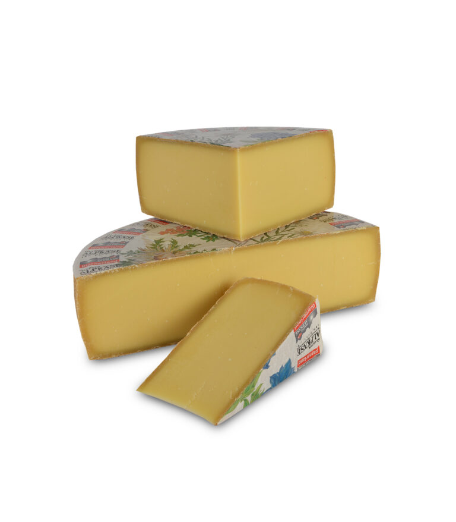
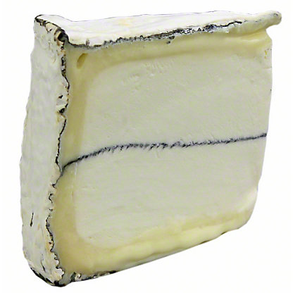
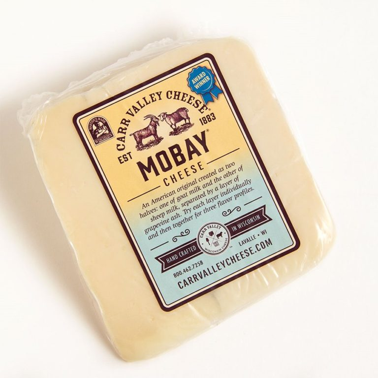

Other 
====================== 
6 Month Aged Ossau Iraty (Agour)
----------------- 
.. image:: cheesepics/51N3Efr+mIL.jpg 
        :align: right 
        :height: 200px 

- **Origin**: Spain
- **Milk**: Sheep
- **Purchase location**: Whole Foods
- **Purchase date**: 07/11/22
- **Julie's comments**: Firm, tan, aged cheese with harder transparentish outer rim & thin funky rind. Grassy & sweet/caramely flavor, but also nice aged nutty & creamy flavor. Gummy texture that turns creamy in mouth. Very snackable.  **3.48/5**
- **Andrew's comments**: Caramely, slightly sharp, salty, creamy inside, with medium soft texture. Extra snackable. Rind is hard & dry, not great texture, but interesting funky taste, quite different.  **3.7/5**

Aged Mimolette (Isigny Ste Mere)
----------------- 
.. image:: cheesepics/eyJidWNrZXQiOiJtZXJjYXRvLWltYWdlcyIsImVkaXRzIjp7InJlc2l6ZSI6eyJmaXQiOiJpbnNpZGUiLCJ3aWR0aCI6NzAwLCJoZWlnaHQiOjQ2N319LCJrZXkiOiJwcm9kdWN0LWltYWdlcy9ERU12aEJBVXgxSFFvc3IwVjJPcU.jpg 
        :align: right 
        :height: 200px 

- **Origin**: France
- **Milk**: Cow
- **Purchase location**: Whole Foods
- **Purchase date**: 09/15/21
- **Julie's comments**: Burnt sienna, orangey hard cheese, tan irregular rind. Nutty, sharp, similar to parmesan but sweeter and creamier/less crumbly. Great alone, maybe with a sweet spread.  **4.0/5**
- **Andrew's comments**: Very nice flavor, nutty & smooth & sweet. Whole foods placard said this was the Willy Wanka of Cheese, but luckily the sweetness is subtle. Tasty solo, doesn't need chips.  **4.1/5**

Appalachian (Meadow Creek)
----------------- 

- **Origin**: Virginia
- **Milk**: Cow
- **Purchase location**: Whole Foods
- **Purchase date**: 02/13/22
- **Julie's comments**: Raw milk cheese, aged 60+ days. Off-yellow firm cheese with a tan brown crumbly rind. Unique flavors - sharp & umami with some funk & also licorice taste. Earthy AF. Pretty smooth texture. I want to like it but also not…  **1.8/5**
- **Andrew's comments**: Very interesting cheese. Texture gradient from smooth medium-hard center to crumbly outer coating. Definitely funky & earthy, with that weirdly pleasant barn floor flavor. Almost too weird, but not quite, I like it.  **3.8/5**

Appalachian (Meadow Creek)
----------------- 

- **Origin**: Virginia
- **Milk**: Cow
- **Purchase location**: Weaver Street
- **Purchase date**: 04/28/22
- **Julie's comments**: Yellowy pale, semi soft cheese with a brown & white soft rind. Creamy, rich, funky in that way that goes up your throat/i9nto nose. Not unpleasant, though. Earthy & woodsy, not very salty, probably good on apples & some pepper jelly. Better first day for me.  **3.49/5**
- **Andrew's comments**: Funky, earthy, a bit horseradishy but not spicy (much). Buttery yellow inside, white moldy rind. Texture is sticky, coats your mouth. Not one I'd want a lot of, but very tasty for a couple bites.  **4.1/5**

Appalachian (Meadow Creek)
----------------- 

- **Origin**: Virginia
- **Milk**: Cow
- **Purchase location**: Weaver Street
- **Purchase date**: 10/01/22
- **Julie's comments**: Firm yellowy-tan cheese with a flaky, cakey, brown and white rind. Very grassy, a bit staticky/funky taste, especially at the rind. Some nutty and woodsy flavor, some aged Comte vibes. Not a great melty cheese nor is it super snackable…  **1.85/5**
- **Andrew's comments**: Nutty, semi sweet, almost meaty flavor in interior, quite funky/barny rind. Really nice semi firm, smooth, chewy texture. I think this one is quite snackable, at least in center.  **3.9/5**

Apple Cider Showmmmz (Wegmans)
----------------- 
.. image:: cheesepics/showmmmz.png 
        :align: right 
        :height: 200px 

- **Origin**: France
- **Milk**: Cow
- **Purchase location**: Wegmans
- **Purchase date**: 09/04/22
- **Julie's comments**: Soft but sturdy ivory cheese with a tan-brown crumbly, slimyish rind. Subtle grassy, mushroomy flavor, salty at the end, a bit of funky tang, especially at rind. Decent cheese, incredible name, okay flavor.  **2.38/5**
- **Andrew's comments**: Interesting flavor/texture profression, from salty, chewy, gritty rind at first, hint of a "bright" flavor I can't place. Then moves into grassy, funky, brie-like (but firmer) center. Aftertaste is less pleasant.  **3.4/5**

Casatica di Bufala (Quattro Portoni)
----------------- 
.. image:: cheesepics/a14ebac6bde044aa824200bbf485cc0f.jpg 
        :align: right 
        :height: 200px 

- **Origin**: Italy
- **Milk**: Water buffalo
- **Purchase location**: Wegmans
- **Purchase date**: 10/09/22
- **Julie's comments**: Soft white cheese with a grayish moldy looking rind. Bitter with a bummy fresh mozzarella-y texture. Way down tastes kind of buttery and sweet like Brie but overtop of it it's just bitter. But maybe ours is bad or old. A little funky too. Not my favorite, was better when first opened but still not my favorite.  **0.8/5**
- **Andrew's comments**: I really don't like this one. Flavor is a mix of metallic bitterness and funky barn dirt. Some creamy Brie in there somewhere but hard to find. Interior is unpleasant gummy texture and rind is unpleasant crumbly texture. The Wegmans guy said it was nice warmed up as a spread, which we didn't try, to be fair. But I doubt it.  **0.4/5**

Doeling (Boxcar)
----------------- 
.. image:: cheesepics/doeling.jpg 
        :align: right 
        :height: 200px 

- **Origin**: North Carolina
- **Milk**: Goat
- **Purchase location**: Weaver Street
- **Purchase date**: 07/18/22
- **Julie's comments**: Soft creamy white cheese with occasional green flakes in center & rind. Creamy, salty, that soft cheese funk that has gotten more aggressive with time. Sends that staticy flavor in my throat… distracts me from any other flavors.  **1.76/5**
- **Andrew's comments**: Soft gooey center, a bit slimy, with pretty thin firmer rind. Salty & funky. Hard to explain why but I don't care for this brand of funk as much as others like New Moon.  **1.8/5**

Fontina (Trader Joe's)
----------------- 
.. image:: cheesepics/fontina-semi-soft-cheese.jpg 
        :align: right 
        :height: 200px 

- **Origin**: Unknown
- **Milk**: Cow
- **Purchase location**: Trader Joe's
- **Purchase date**: 06/01/21
- **Julie's comments**: Pale off-white, semi hard. Versatile. Relatively neutral, not sharp. Semi creamy, a tangier after taste. Melts well, good with spicy.  **3.1/5**
- **Andrew's comments**: Mild flavored, pretty creamy. Nice texture - slightly chewy. Not the most interesting solo, but plays great with others (chips, TJ green sauce, med deli)  **2.6/5**

Fontina Val D'Aosta (Mitica)
----------------- 
.. image:: cheesepics/daosta.png 
        :align: right 
        :height: 200px 

- **Origin**: Italy
- **Milk**: Cow
- **Purchase location**: Whole Foods
- **Purchase date**: 05/02/22
- **Julie's comments**: Tan semi firm smooth-looking cheese with a patterned thin rind - gradient of firmness toward rind. Interior is smooth, a bit gummy, with woodsy, nutty, creamy, mild flavor. Exterior is very funky, tangy, almost bitter. Ages fine.  **2.04/5**
- **Andrew's comments**: Very subtle - nice & interesting flavor, but you have to pay attention. Nutty, buttery, semi-funky especially at rind. Very pleasant texture. Semi-hard, with gradient, and particley rind. Bit bitter as aged.  **2.8/5**

Gabietou (Herve Mons)
----------------- 
.. image:: cheesepics/tumblr_27c2b53307a44acad637f1164ef071ae_e881b478_500.jpg 
        :align: right 
        :height: 200px 

- **Origin**: France
- **Milk**: Cow + Sheep
- **Purchase location**: Whole Foods
- **Purchase date**: 07/09/22
- **Julie's comments**: Semi firm/kinda soft tan cheese with a brown crusty rind. Creamy but firm texture. Salty & sheep/funky up front but pretty mellow. Rind is dirt-like and not my fave, but isn't bad. Solid mildly funky cheese.  **3.19/5**
- **Andrew's comments**: Soft center with gritty-but-in-a-pleasing-way rind, nice texture. Salty, semi-funky rind but mildish center. A bit sweet even. Hard to rate, interesting but also a bit boring simultaneously.  **2.8/5**

Glarner Alpkase (Alp Heuboden)
----------------- 

- **Origin**: Switzerland
- **Milk**: Cow
- **Purchase location**: Weaver Street
- **Purchase date**: 11/07/22
- **Julie's comments**: Firm tan cheese with a gritty light brown rind. Grassy, earthy, salty flavor - kind of salty & a bit funky at the end. Similar taste to a Comte, but less funky & better. Gummyish texture, a bit dry after time.  **2.45/5**
- **Andrew's comments**: Grassy, Comte-like cheese, but I like it better than most of this style. Center had unique salty sweet flavor. Outer rind funkier, less tasty. Texture good at first, but dried & got a bit gummy.  **3.7/5**

Grayson (Meadow Creek)
----------------- 

- **Origin**: Virginia
- **Milk**: Cow
- **Purchase location**: Weaver Street
- **Purchase date**: 08/01/21
- **Julie's comments**: Aged over 60 days. This is a funky cheese. Semi soft inside, hard crusty rind. Deep, fatty flavor, that is also kind of fishy? Pork/ham notes, quite umami. Okay on cracker, slightly warmed on a bittery salad.  **1.6/5**
- **Andrew's comments**: Did not like this at first but it has grown on me. Definitely funky with strongish smell and weird mix of textures (soft middle, rubbery outside). But flavor is interesting, with a couple "waves". Somehow the aftertaste reminds me of a barn, more pleasant than it sounds.  **2.1/5**

Harbison Spruce Bark-Wrapped Bloomy Rind Cheese (Jasper Hill Farm)
----------------- 

- **Origin**: Vermont
- **Milk**: Cow
- **Purchase location**: Carlinos
- **Purchase date**: 09/17/22
- **Julie's comments**: Soft white/tan creamy cheese wrapped in leathery bark. Complex funky yet sweet/caramel flavor. Not salty, tastes rich & fattry, also mushroomy, barky. Designed to pair with Rasberry Mostarda jam/mustard combo, which is amazing (separate & together). Unique, hard to rate, subtle & tasty but not my usual style. I respect this cheese.  **3.67/5**
- **Andrew's comments**: Milky, buttery, salty taste, a bit sweet. Smells very funky but taste is surprisingly mild (note: other bites funkier). Interesting texture prile - light and gooey, almost slimy center, with chewy exterior. Very nice pairing with mustard raspberry jam.  **4.0/5**
- **Thanks to Barb & Rob Necarsulmer for this cheese!**

Hickory Grove (Chapel Hill Creamery)
----------------- 
.. image:: cheesepics/1350f13d6c2df6d7f334d5e2e93cb40a.jpg 
        :align: right 
        :height: 200px 

- **Origin**: North Carolina
- **Milk**: Cow
- **Purchase location**: Weaver Street
- **Purchase date**: 08/21/21
- **Julie's comments**: Butter and cheddar and a leeetle brie had a hot threesome to make this fine cheese. Semi soft, pale yellow/firm rind. A bit funky but only subtly (but smells funkier). Great on crackers, with salty spread, or alone. Creamy inside.  **4.81/5**
- **Andrew's comments**: A top tier cheese to be sure. Very buttery and nice semi squishy texture, kind of like a butter & paneer baby (but better than that sounds). Great with salty tortilla chips.  **4.7/5**

Hika Bay (Saxon Homestead Creamery)
----------------- 
.. image:: cheesepics/51lT2Z3we-L._SX679_.jpg 
        :align: right 
        :height: 200px 

- **Origin**: Wisconsin
- **Milk**: Cow
- **Purchase location**: Whole Foods
- **Purchase date**: 10/26/22
- **Julie's comments**: Pale yellow cheese with thin orange waxy rind. Mild, aged nuttiness - a bit of swiss-like grassy flavor, a bit of brown butter later. Snackable for sure, versatile cheese, does dry out at the edges so seal well.  **3.39/5**
- **Andrew's comments**: Nutty, milky, Swissy flavor. Very mild, pretty boring tbh. Texture is crumbly & sort of dry (though we bought on sale so maybe a bit old). Tasty enough but unremarkable.  **2.1/5**

Hika Bay (Saxon Homestead Creamery)
----------------- 
.. image:: cheesepics/51lT2Z3we-L._SX679_.jpg 
        :align: right 
        :height: 200px 

- **Origin**: Wisconsin
- **Milk**: Cow
- **Purchase location**: Whole Foods
- **Purchase date**: 08/16/22
- **Julie's comments**: Firm, tan cheese with pale orange rind - smooth consistent gummy/creamy texture. Mild nutty & toast/caramel/butterscotch (?) flavor, also buttercream, not salty. Multifunctional cheese. Would pair with most things. Not remarkable, but good.  **3.18/5**
- **Andrew's comments**: At first it tastes like Swiss, but tastier & more complex. Nutty & caramely & a bit sweet. Texture is smooth & a bit gummy, but not too much. Some occassional crystal "sparkles". Not a fave, but good & unique addition to cheese board.  **3.3/5**

Humboldt Fog (Cypress Grove)
----------------- 

- **Origin**: California
- **Milk**: Goat
- **Purchase location**: Wegmans
- **Purchase date**: 12/25/21
- **Julie's comments**: Funky, stinky, smokey-ish cheese. Staticky after taste. Creamy center with thick, white/green rind, salty. Liked on day 1, but less so on day 2. I am conflicted. Would probably like more on a burger or something.  **3.2/5**
- **Andrew's comments**: Very soft and creamy, funky taste, blue-ish flavor. Interesting texture, different parts are gooey/chewy. Similar to Leonara, but not as good.  **3.5/5**
- **Thanks to Barb & Rob Necarsulmer for this cheese!**

Kaltbach Le Cremeaux (Emmi)
----------------- 
.. image:: cheesepics/kaltbach.png 
        :align: right 
        :height: 200px 

- **Origin**: Switzerland
- **Milk**: Cow
- **Purchase location**: Whole Foods
- **Purchase date**: 10/30/21
- **Julie's comments**: Creamy, nutty, smooth with subtle funkiness. Semi hard, off-white color. Stands alone but great with chips, definitely a fave.  **4.68/5**
- **Andrew's comments**: Very nice cheese to eat alone (like by itself, you can be with loved ones). Nutty, creamy, but subtle, very umami.  **4.3/5**

Mobay (Carr Valley)
----------------- 

- **Origin**: Wisconsin
- **Milk**: Goat + Sheep
- **Purchase location**: Whole Foods
- **Purchase date**: 07/09/22
- **Julie's comments**: Layered off white cheese, bottom layer light color, thin blue/brown line, then speckled tan - firmish, no rind. Creamy, tangy goat-cheese-like flavor - light, a bit buttery on tan side (but both sides taste very similar). Like cheddar & goat & Manchego.  **4.01/5**
- **Andrew's comments**: Interesting look, not much variation in taste despite line through middle. Sharp, creamy, a bit tangy. Quite a bit like sharp white cheddar, but a bit fuller flavor profile. Super snackable, could eat a lot of this. Not the most unique but solid choice for spread.  **3.5/5**

Naked Goat Cheese (Quesera Montesinos)
----------------- 
.. image:: cheesepics/nakedgoat.png 
        :align: right 
        :height: 200px 

- **Origin**: Spain
- **Milk**: Goat
- **Purchase location**: Fresh Market
- **Purchase date**: 07/02/22
- **Julie's comments**: Slightly off-white, firm, mildly crumbly cheese, no rind. Creamy texture when softened. Tangy goat flavor, grassy, slightly acid, buttery flavor. Incredibly snackable - could eat a whole block at once.  **4.29/5**
- **Andrew's comments**: Mmmm so tasty & snackable. Salty, tangy, creamy, some cottage cheese essence but tastier. Fairly soft & crumbly, plus some melting in mouth.  **4.55/5**

P'Tit Basque Sheep's Milk Cheese (Istara)
----------------- 
.. image:: cheesepics/ptitbasque.png 
        :align: right 
        :height: 200px 

- **Origin**: France
- **Milk**: Sheep
- **Purchase location**: Wegmans
- **Purchase date**: 10/09/22
- **Julie's comments**: Tan cheese (pale, off white) with a light brown patterned rind. Firm cheese, dry texture, but not in a bad way. Mild flavor, nutty, not salty, a mild caramel flavor. Tastes a bit like a Cheddar. Very snackable and tasty.  **3.97/5**
- **Andrew's comments**: Nutty, creamy, slightly sweet, slightly sharp, just a tiny hint of funk if you look for it (more on rind), but pretty mild overall. Taste reminds me of Manchego a bit, but texture more chewy. Supremely snackable.  **4.1/5**

Paradiso Reserve (Beemster Cheese)
----------------- 
.. image:: cheesepics/Paradiso_Reserve_silver_014011_Wheel+w+Wedge.png 
        :align: right 
        :height: 200px 

- **Origin**: Netherlands
- **Milk**: Cow
- **Purchase location**: Wegmans
- **Purchase date**: 09/04/22
- **Julie's comments**: Firm-to-hard pale orange cheese with a wax rind. Aged cheese, nutty, salty, umami with salty crystals in the center in some bites. Tastes like a Gouda and a sharp cheddar or Manchego. Very snackable - does dry out pretty quickly though.  **3.91/5**
- **Andrew's comments**: Tasty, caramelly, nutty, and a bit tangy. Nice semi firm texture, with occassional crystals. Very snackable, but year it dries out, especially around rind.  **3.5/5**

Parrano Originale (Parrano)
----------------- 
.. image:: cheesepics/large_7b4331bc-06f8-4838-a521-bb65fe7fc096.png 
        :align: right 
        :height: 200px 

- **Origin**: Netherlands
- **Milk**: Cow
- **Purchase location**: Weaver Street
- **Purchase date**: 03/05/22
- **Julie's comments**: Tan/yellow cheese, firm, with a red & white rind. Very Gouda-like, nutty & sharp, creamy & buttery. Pretty mild & versatile. Good with crackers & jam. Quite snackable.  **3.04/5**
- **Andrew's comments**: Gouda-like at center, nutty & caramely, soft texture not my favorite, but flavor is nice though mild. Harder near rind, nicer texture. Dried out a bit, trying to remember initial impressions.  **2.7/5**

Pichin (Lou Bergier)
----------------- 
.. image:: cheesepics/Lou-Bergier-Pichin-2.jpg 
        :align: right 
        :height: 200px 

- **Origin**: Italy
- **Milk**: Cow
- **Purchase location**: Weaver Street
- **Purchase date**: 03/07/22
- **Julie's comments**: Raw cow milk, sea salt, thistle flowers. A unique cheese - white, firm, tan waxy rind. Very mild tangy funk up front, then salty, some grassy butter taste. Tasted some floral notes when first opened, but not by day 3. Quite pleasing.  **3.92/5**
- **Andrew's comments**: I go back & forth on this one, not sure if it's different parts of the cheese, or just different nights & moods. At its best, it's buttery/creamy, tangy, unique flavor. Nice semi-hard texture. At less inspired moments it reminds me of generic white cheddar.  **3.3/5**

Pyrenees Brebis (Murray's Cheese)
----------------- 
.. image:: cheesepics/pyrenees.png 
        :align: right 
        :height: 200px 

- **Origin**: France
- **Milk**: Sheep
- **Purchase location**: Murray's Cheese
- **Purchase date**: 01/14/22
- **Julie's comments**: Firm, pale cheese with a thick gradient exterior/rind (I like the rind). Nutty, earthy & buttery, lovely rich flavor. Creamy in mouth when heated but not at room temperature. A unique flavor to me - umami, a bit of salt. Would be nice with white wine, maybe Chardonnay  **4.73/5**
- **Andrew's comments**: Quite subtle taste but very nice when you pay attention. Nutty earthy sheeps milk taste. Very unique texture, with gradient from medium to hard, and almost sandy rind (but in pleasant way).  **4.3/5**
- **Thanks to Tim & Abigail Necarsulmer for this cheese!**

Quadrello di Bufala (Quattro Portoni)
----------------- 
.. image:: cheesepics/4797.jpg 
        :align: right 
        :height: 200px 

- **Origin**: Italy
- **Milk**: Water buffalo
- **Purchase location**: Whole Foods
- **Purchase date**: 03/14/22
- **Julie's comments**: Creamy, soft, salty cheese with a salty, gritty rind. A bit hunky, but not stinky at all. Goes great on crackers (needs a crisp), with a jam or preserves. This cheese grew on me.  **4.12/5**
- **Andrew's comments**: Brie-like texture, very creamy, fairly mild but has a nice salty funk if you pay attention, especially at rind, with interesting gritty texture. Grew on me too, maybe the rind at back was a bit more flavorful.  **3.8/5**

Redbud (Boxcar)
----------------- 
.. image:: cheesepics/Redbud-1.jpg 
        :align: right 
        :height: 200px 

- **Origin**: North Carolina
- **Milk**: Cow + Goat
- **Purchase location**: Weaver Street
- **Purchase date**: 03/19/22
- **Julie's comments**: Pimenton rubbed & smoked cheese. Hard, yellow/tan, aged cheese with a mottled red/brown thin rind - paprika-y! Mild nutty, salty, tangy flavor in interior. Subtle smoky, woodsy, mildly funky exterior by rind. Quite snackable, a bit dry. Great with pepper jelly.  **2.89/5**
- **Andrew's comments**: Hard yellow cheese with interesting granules adding texture. Dried out a bit since we got it. Nutty, salty-sweet, & smoky/spicy (mild) after taste. Semi-funky rind. Great on its own, with chips, or with pepper jelly.  **4.3/5**

Rocket's Robiola (Boxcar)
----------------- 
.. image:: cheesepics/2017-10-american-cheese-09573-1024x683.jpg 
        :align: right 
        :height: 200px 

- **Origin**: North Carolina
- **Milk**: Cow
- **Purchase location**: Weaver Street
- **Purchase date**: 03/19/22
- **Julie's comments**: Funky AF, mild stinky cheese - gray ashy rind, creamy/gooey under rind, then soft crumbly white interior. The gooey part has brie-like flavor - tangy, funky, creamy. Center is more funky, kind of sour, earthy. Rind is deep, earthy, sooty. Good with strawberry habenero jam. Tough to rate.  **2.0/5**
- **Andrew's comments**: Truly strange & unique cheese, different flavors come in waves. Funky, stinky rind, then gooey, slimy layer, then soft chevre-like texture. Creamy Brie flavor up front, then earthier barny flavors, then smokey finish. I have to rate higher than pure enjoyment out of sheer uniqueness.  **3.7/5**

Sparkenhoe Red Leicester (Neals Yard)
----------------- 

- **Origin**: England
- **Milk**: Cow
- **Purchase location**: Whole Foods
- **Purchase date**: 03/26/22
- **Julie's comments**: Bright orange firm aged cheese with a thin waxy rind. Mild flavor - nutty, a bit of sweetness, very earthy taste - kind of like a more mellow cheddar & some dirt. Decent, but not thrilling. Probably would be good melted on a burger.  **2.4/5**
- **Andrew's comments**: A bit sharp, a bit nutty, a bit earthy. Strange after taste. Hard, a bit crumbly, gritty.  **1.8/5**

Spring Fever (Prodigal Farm)
----------------- 
- **Origin**: North Carolina
- **Milk**: Goat
- **Purchase location**: Weaver Street
- **Purchase date**: 03/26/22
- **Julie's comments**: Soft white cheese with crumbly white center, off-white creamy outer layer, & classic white textured rind. Tangy, salty chevre-like interior, then creamy buttery Brie-like outer layer. Mild funk especially in creamy part, which I like less. Has metallic after taste. Overall I like a lot, surprisingly. So good with pepper jelly.  **4.39/5**
- **Andrew's comments**: So good & unique. Super creamy, texture in between chevre & Brie. Also has tangy flavor, lemony, some bites even remind me of lemon bar (cheesecake version), but not sweet. Semi salty & nic, mild funk. Agreed about pepper jelly.  **4.85/5**

Swiss Raclette (Emmi)
----------------- 
.. image:: cheesepics/Emmi-Swiss-Raclette-Cheese_Square.jpg 
        :align: right 
        :height: 200px 

- **Origin**: Switzerland
- **Milk**: Cow
- **Purchase location**: Whole Foods
- **Purchase date**: 03/26/22
- **Julie's comments**: Firm off white/yellowish cheese with a thin speckled white rind. Mild, nutty, earthy slightly sharp flavor, a bit sweet. Gummy/sticky/thick texture. Needs melting/toasting or something. Would be good raclette. Underwhelming, but not bad.  **1.6/5**
- **Andrew's comments**: Mild, slightly sharp white cheese. Chewy/gooey, sort of unpleasant texture. Agreed, might be better melty, but pretty boring elsewise.  **1.4/5**

The Smokin' Goat (Mitica)
----------------- 
.. image:: cheesepics/smokingoat.png 
        :align: right 
        :height: 200px 

- **Origin**: Spain
- **Milk**: Goat
- **Purchase location**: West Chester Food Cupboard
- **Purchase date**: 09/17/22
- **Julie's comments**: Ivory cheese with a tan thin rind - firm, homogeous. Mild goaty, tangy with a nutty and butter/umami after notes, like a Gouda I think. Snackable, unremarkable.  **2.45/5**
- **Andrew's comments**: Smoky, meaty flavor, and some sweeter caramelly, tangy notes. Semi-rubbery, smooth texture, slightly harder rind. Super snackable, could eat a lot of this. But not the most remarkable.  **3.6/5**
- **Thanks to Barb & Rob Necarsulmer for this cheese!**

Unknown (starts with B) (Unknown)
----------------- 
- **Origin**: Unknown
- **Milk**: Unknown
- **Purchase location**: Unknown
- **Purchase date**: 04/01/21
- **Julie's comments**: Dry, hard, a little like Parmesan, but less nutty. A bit bitter? Not melty.  **2.3/5**
- **Andrew's comments**: Dry and a little crumbly mouth feel. Agreed Parmesany, but less flavorful slightly. Probably good on top of food? But kind of boring as standalone cheese.  **1.8/5**

Valtellina Casera (Unknown)
----------------- 
.. image:: cheesepics/69ab8b3e427a6bd756e47275c6c8a368.jpg 
        :align: right 
        :height: 200px 

- **Origin**: Italy
- **Milk**: Cow
- **Purchase location**: Harris Teeter
- **Purchase date**: 04/20/22
- **Julie's comments**: Pale, off-white hard aged cheese with some white crystals through interior. Very nutty, a bit woodsy, with a slight caramel after taste, kind of Pecorino-like. Very snackable, will dry out with time. *Note: rated whilst COVID infected, taste mostly unaffected  **3.74/5**
- **Andrew's comments**: Interior of cheese is salty, umami, a bit sour/citrusy & nutty. Between a Pecorino Romano & Caciacavallo. Near the rind is hard & rubbery & less flavorful, maybe ours dried out. Rated 3.6 interior, 1.5 exterior.  **2.6/5**

Zamarano (Mitica)
----------------- 
.. image:: cheesepics/large_d8458e12-1f6d-4b40-8576-52ce99b9bd1c.jpg 
        :align: right 
        :height: 200px 

- **Origin**: Spain
- **Milk**: Sheep
- **Purchase location**: Whole Foods
- **Purchase date**: 05/15/22
- **Julie's comments**: Off white firm cheese with thin patterned red-brown rind. Creamy, milky, mildly tangy/yogurty flavor. A bit grassy, chalky in a good way, also has tastes of sliced American cheese, but only the good part of that. Versatile, snackable, but not a standout. Lasts long! Cool.  **3.23/5**
- **Andrew's comments**: Salty, creamy, tangy, semi-sharp. True, a hint of American cheese vibe, but very tasty. Nice semi-firm texture, with some subtle gritty "sparkles", and I like the grooves on rind. Very snackable, and would make amazing grilled cheese/mac & cheese.  **4.1/5**

