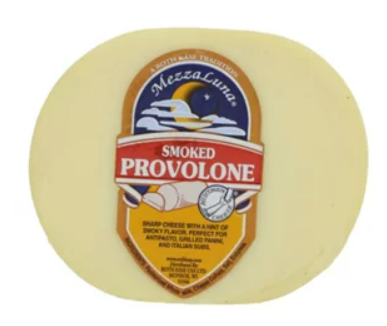

Provolone 
====================== 
Provolone Picante (Auricchio)
----------------- 
.. image:: cheesepics/AURICCHIO-PROVOLONE.jpg 
        :align: right 
        :height: 200px 

- **Origin**: Italy
- **Milk**: Cow
- **Purchase location**: Unknown
- **Purchase date**: 01/09/22
- **Julie's comments**: Sharp, salty, tangy, SHARP cheese, with nutty undertones. Great with a zesty pasta sauce and an Italian red wine. Firm, dense, and layered/stringy texture with flavor that lingers. Stands well alone.  **3.96/5**
- **Andrew's comments**: Sharp and salty, tastes a bit like the Pecorino Romano I think, but more subtle. Crumbly texture, slightly grainy. Pretty good, but not super memorable.  **2.6/5**
- **Thanks to Giulia Fragola et al for this cheese!**

Smoked Provolone (Mezza Luna)
----------------- 

- **Origin**: Wisconsin
- **Milk**: Cow
- **Purchase location**: Whole Foods
- **Purchase date**: 08/16/22
- **Julie's comments**: Firm, tan round cheese with slightly browner exterior. Mild smoky flavor up front, then a nutty, mozzarella-y, grassy flavor. Gummy texture, dries out with time - so best fresh, and melty. Solid cheese, not remarkable.  **2.52/5**
- **Andrew's comments**: Smoky, meaty, buttery flavor. Smooth & bouncy texture. Tasty & snackable, though a bit processey seeming. Would probably be great on a melty sandwich or quesodilla.  **2.7/5**

