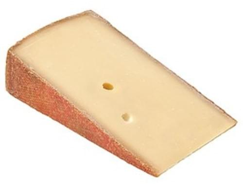

Switzerland 
====================== 
Cave Aged Gruyere (Unknown)
----------------- 
.. image:: cheesepics/49725-GRUYERE-CAVE-AGED-.25-WH-4KG-SWITZERLAND-1.jpg 
        :align: right 
        :height: 200px 

- **Style**: Gruyere
- **Milk**: Cow
- **Purchase location**: Weaver Street
- **Purchase date**: 07/10/22
- **Julie's comments**: Tan cheese, firm, with a brown crusty, crumbly rind. Salty, tangy, grassy, a bit cattle-y? In a nice way. Like comte and also a little cheddar vibes, rind is funky. Creamy, gummy texture. Would be good with jam or pepper jelly.  **2.95/5**
- **Andrew's comments**: Barny, tangy flavor, reminds me of raclette (the cheese, not act), or even fondue flavor. Not my favorite. Texture is a bit gummy, flavor sticks in mouth a while.  **1.6/5**

Challerhocker (Wegmans)
----------------- 

- **Style**: Alpine
- **Milk**: Cow
- **Purchase location**: Wegmans
- **Purchase date**: 09/04/22
- **Julie's comments**: Tan/pale firm cheese with a waxy crumbly rind. Creamy & mildly grainy texture, dissolves quickly. Salty up front, then grassy and then funky (static up the back of nose at end, especially the rind). At first I really didn't like it, but better on day 2.  **1.53/5**
- **Andrew's comments**: This one's ok, a bit overly salty and rather funky in hay-like way. Some nice grains in texture. Does go up nose, less pleasant.  **0.8/5**

Glarner Alpkase (Alp Heuboden)
----------------- 
.. image:: cheesepics/glarner-alpkaese-alt-rezent-jaehrig-glarussell-01-768x878.jpg 
        :align: right 
        :height: 200px 

- **Style**: Other
- **Milk**: Cow
- **Purchase location**: Weaver Street
- **Purchase date**: 11/07/22
- **Julie's comments**: Firm tan cheese with a gritty light brown rind. Grassy, earthy, salty flavor - kind of salty & a bit funky at the end. Similar taste to a Comte, but less funky & better. Gummyish texture, a bit dry after time.  **2.45/5**
- **Andrew's comments**: Grassy, Comte-like cheese, but I like it better than most of this style. Center had unique salty sweet flavor. Outer rind funkier, less tasty. Texture good at first, but dried & got a bit gummy.  **3.7/5**

Kaltbach Le Cremeaux (Emmi)
----------------- 
.. image:: cheesepics/kaltbach.png 
        :align: right 
        :height: 200px 

- **Style**: Other
- **Milk**: Cow
- **Purchase location**: Whole Foods
- **Purchase date**: 10/30/21
- **Julie's comments**: Creamy, nutty, smooth with subtle funkiness. Semi hard, off-white color. Stands alone but great with chips, definitely a fave.  **4.68/5**
- **Andrew's comments**: Very nice cheese to eat alone (like by itself, you can be with loved ones). Nutty, creamy, but subtle, very umami.  **4.3/5**

Swiss Raclette (Emmi)
----------------- 
.. image:: cheesepics/Emmi-Swiss-Raclette-Cheese_Square.jpg 
        :align: right 
        :height: 200px 

- **Style**: Other
- **Milk**: Cow
- **Purchase location**: Whole Foods
- **Purchase date**: 03/26/22
- **Julie's comments**: Firm off white/yellowish cheese with a thin speckled white rind. Mild, nutty, earthy slightly sharp flavor, a bit sweet. Gummy/sticky/thick texture. Needs melting/toasting or something. Would be good raclette. Underwhelming, but not bad.  **1.6/5**
- **Andrew's comments**: Mild, slightly sharp white cheese. Chewy/gooey, sort of unpleasant texture. Agreed, might be better melty, but pretty boring elsewise.  **1.4/5**

