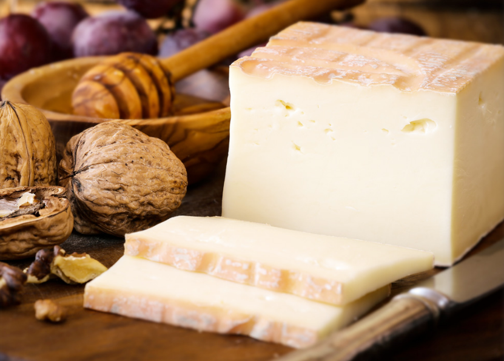

Taleggio 
====================== 
Taleggio (Unknown)
----------------- 

- **Origin**: Italy
- **Milk**: Cow
- **Purchase location**: Weaver Street
- **Purchase date**: 01/08/22
- **Julie's comments**: A creamy, funky, salty cheese with a soft interior and crusty exterior. Has a special blue-green "cat fur" (or something) mold on outside. Grew on me but not my favorite. Maybe needs a fig jam or something?  **2.5/5**
- **Andrew's comments**: Very creamy, soft buttery texture. A bit of funk but fairly subtle. Really nice on salty chip.  **3.9/5**

Taleggio DOP (Unknown)
----------------- 

- **Origin**: Italy
- **Milk**: Cow
- **Purchase location**: Unknown
- **Purchase date**: 01/09/22
- **Julie's comments**: Woah! This is tasty and very different from other Taleggio. Unique cheese. Very creamy, a bit buttery, tangy and salty (maybe a bit too salty). Firmer than Brie but similar texture. Excellent with red wine and a simple cracker.  **4.57/5**
- **Andrew's comments**: Quite rich and creamy, soft but "sticker" texture than other Taleggio. I wish it had a firmer rind like the other. Tastes fairly funky and quite salty. Feels a bit one dimensional compared to the other Taleggio.  **2.7/5**
- **Thanks to Giulia Fragola et al for this cheese!**

