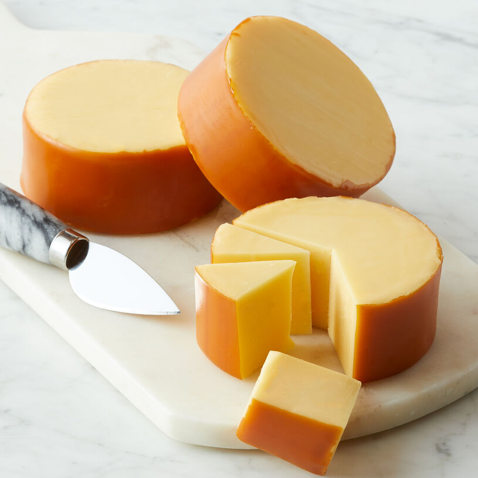

Unknown 
====================== 
Fontina (Trader Joe's)
----------------- 

- **Style**: Other
- **Milk**: Cow
- **Purchase location**: Trader Joe's
- **Purchase date**: 06/01/21
- **Julie's comments**: Pale off-white, semi hard. Versatile. Relatively neutral, not sharp. Semi creamy, a tangier after taste. Melts well, good with spicy.  **3.1/5**
- **Andrew's comments**: Mild flavored, pretty creamy. Nice texture - slightly chewy. Not the most interesting solo, but plays great with others (chips, TJ green sauce, med deli)  **2.6/5**

Smoked Gouda (Unknown)
----------------- 

- **Style**: Gouda
- **Milk**: Unknown
- **Purchase location**: Weaver Street
- **Purchase date**: 07/23/22
- **Julie's comments**: Firm, tan-yellow cheese with slightly darker yellow-brown thin rind. Gummy, creamy texture. Nutty, buttery flavor with smokiness later - subtle umami, not overpowering smoke. Could mindlessly eat half a block - not thrilling but quite snackable.  **3.23/5**
- **Andrew's comments**: Nice smoky smell, semi-smoky taste with creamy nuttiness. Gummy texture, reminds me of cheap processed cheese like Monterrey Jack, not my favorite. Definitely snackable, trail vibes. Very tasty with hummus.  **2.4/5**

Unknown (starts with B) (Unknown)
----------------- 
- **Style**: Other
- **Milk**: Unknown
- **Purchase location**: Unknown
- **Purchase date**: 04/01/21
- **Julie's comments**: Dry, hard, a little like Parmesan, but less nutty. A bit bitter? Not melty.  **2.3/5**
- **Andrew's comments**: Dry and a little crumbly mouth feel. Agreed Parmesany, but less flavorful slightly. Probably good on top of food? But kind of boring as standalone cheese.  **1.8/5**

