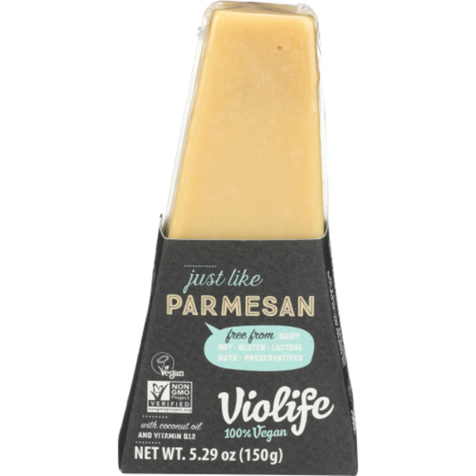

Vegan 
====================== 
Just Like Parmesan (Violife)
----------------- 

- **Origin**: Greece
- **Milk**: Vegan
- **Purchase location**: Unknown
- **Purchase date**: 09/01/21
- **Julie's comments**: Does not taste just like parmesan, unfortunately. Hard, a bit grainy, starchy. Similar flavor to nutritional yeast - umami, salty. Performed okay blended into pesto. By itself, icky - mixed in with stuff, ok.  **0.8/5**
- **Andrew's comments**: Yeah definitely not parmesan… tastes a little more similar when dusted, but eating a chunk is unpleasant texture & salty taste that isn't super cheesy.  **0.6/5**

Roasted Garlic Plant-Based Cheese Wedge (Dare)
----------------- 

- **Origin**: North Carolina
- **Milk**: Vegan
- **Purchase location**: Asheville Farmer's Market
- **Purchase date**: 10/22/22
- **Julie's comments**: Pale white soft cheese in a wedge shape but the consistency of cream cheese. Tastes a bit like cream cheese, garlic flavor, also like helluva good French onion dip…yum…addictive. Not very cheese-like, more of a spread, but so tasty. Taste/general: 4.42/5. Vegan: 4.92/5. Cheesiness: 1.3/5.  **4.42/5**
- **Andrew's comments**: Garlicky, salty, tastes justs like French onion dip. Airy cream cheese texture that melts in mouth. Not a huge fan of flavored cheeses generally (what's it hiding?), but definitely tasty as a spread, & impressive for vegan. General: 3.2/5. Vegan: 4.7/5.  **3.2/5**

