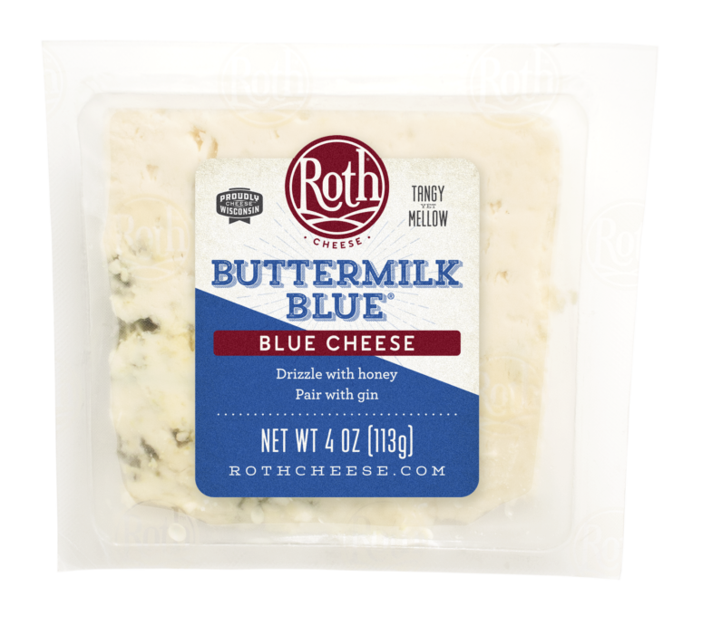
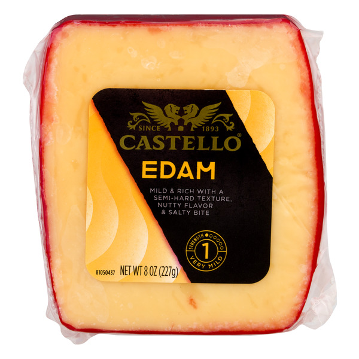
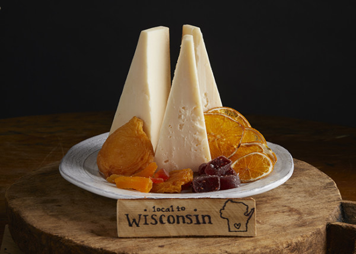
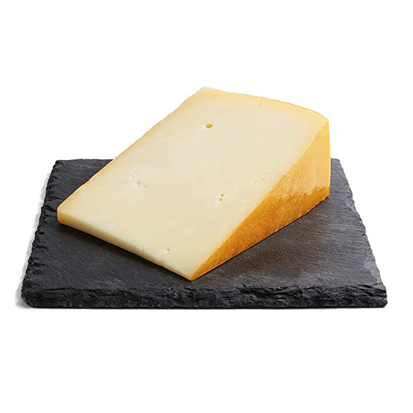
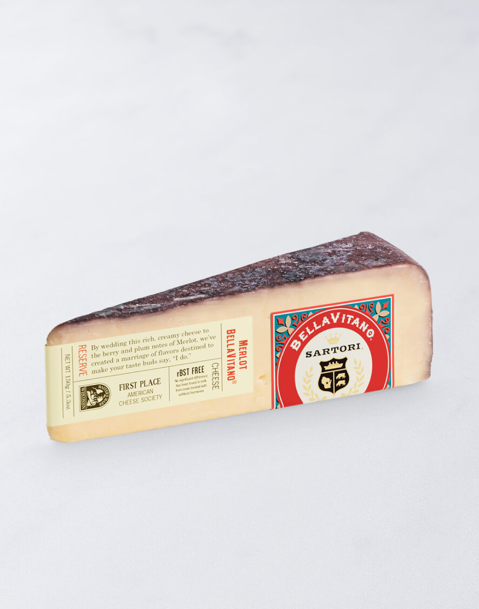
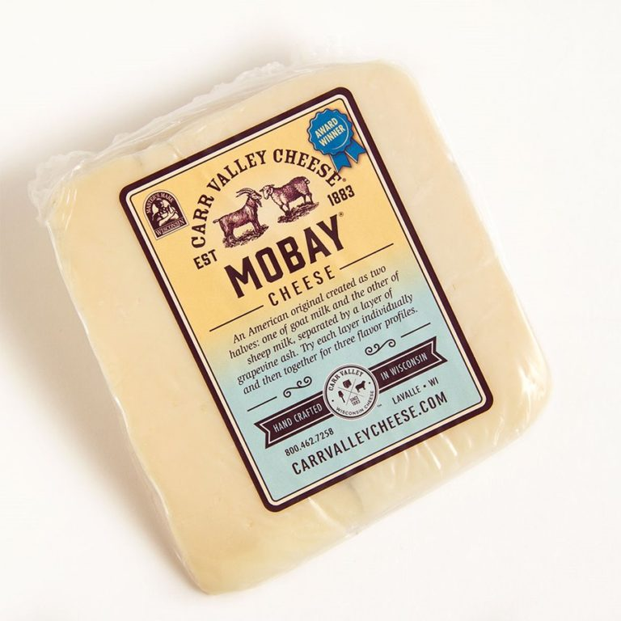
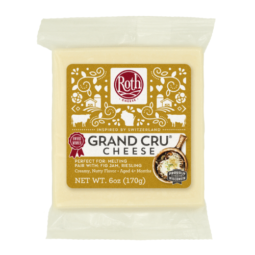
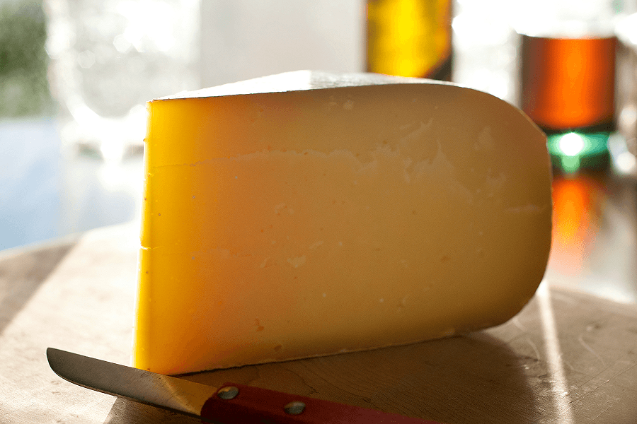
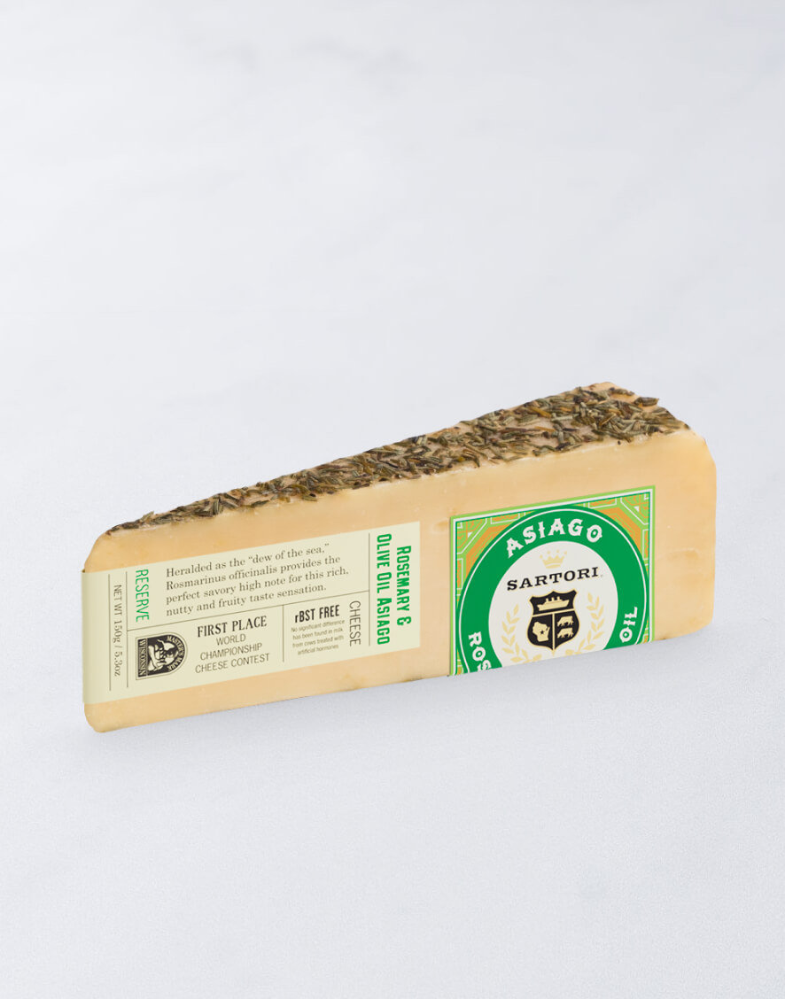
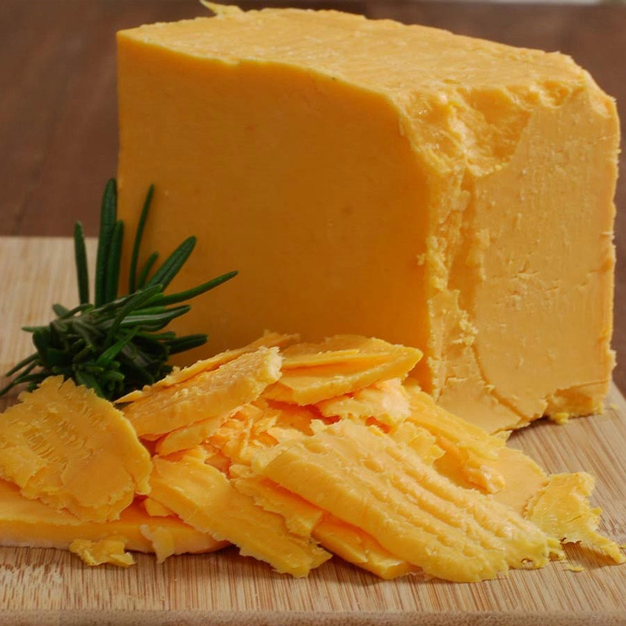

Wisconsin 
====================== 
Buttermilk Blue Cheese (Roth)
----------------- 

- **Style**: Blue
- **Milk**: Cow
- **Purchase location**: Giant
- **Purchase date**: 05/28/22
- **Julie's comments**: Salty, stinky, funky, creamy crumbly white & blue-grey cheese with no rind. Usually not my thing, but this is pretty good with savory foods, less salty chips (cheese itself very salty)  **2.34/5**
- **Andrew's comments**: Salty, funky, creamier than most blue. Tasty in food (on buffalo chik patties, in stirfry), but ok solo or with chips too. Gets kind of old though, don't want too much of it.  **2.3/5**
- **Thanks to Barb & Rob Necarsulmer for this cheese!**

Edam (Castello)
----------------- 

- **Style**: Edam
- **Milk**: Cow
- **Purchase location**: Unknown
- **Purchase date**: 06/01/21
- **Julie's comments**: Pale yellow/tan, firm but semi hard. Sharp, like a mild cheddar. Creamy, a bit nutty. Good melted. Pretty mild.  **3.0/5**
- **Andrew's comments**: Pretty mild, somewhat sharp. Chewy/bouncy texture. Good snack cheese, reminds me of cubes on cheese tray, fairly unmemorable.  **2.3/5**

Evalon  (LaClare Creamery)
----------------- 

- **Style**: Parmesan
- **Milk**: Goat
- **Purchase location**: Fromagination
- **Purchase date**: 07/01/21
- **Julie's comments**: Hard, tan, aged cheese. Goat's milk, can tell especially in after taste. Salty & nutty, a bit earthy. Tastes like Parmesan and a hard goat cheese. Quite interesting.  **4.75/5**
- **Andrew's comments**: Very interesting and unique flavor, similar to Parmesan or asiago but more subtle. Not my favorite texture (slightly grainy), but otherwise amazing.  **4.5/5**
- **Thanks to Allie Bukowski & Glenn Palmer for this cheese!**

Hika Bay (Saxon Homestead Creamery)
----------------- 

- **Style**: Other
- **Milk**: Cow
- **Purchase location**: Whole Foods
- **Purchase date**: 08/16/22
- **Julie's comments**: Firm, tan cheese with pale orange rind - smooth consistent gummy/creamy texture. Mild nutty & toast/caramel/butterscotch (?) flavor, also buttercream, not salty. Multifunctional cheese. Would pair with most things. Not remarkable, but good.  **3.18/5**
- **Andrew's comments**: At first it tastes like Swiss, but tastier & more complex. Nutty & caramely & a bit sweet. Texture is smooth & a bit gummy, but not too much. Some occassional crystal "sparkles". Not a fave, but good & unique addition to cheese board.  **3.3/5**

Merlot Bellavitano (Sartori)
----------------- 

- **Style**: Flavored
- **Milk**: Cow
- **Purchase location**: Unknown
- **Purchase date**: 01/01/22
- **Julie's comments**: Hard/firm pale cheese with deep purple rind. Rind tastes like wine! Sharp aged cheese that is excellent for snacking. Great with wine, chocolate, most things.  **4.11/5**
- **Andrew's comments**: Semi hard, semi crumbly texture. Nutty flavor, somewhat sweet, with salty wine rind. Very tasty alone or with chips, excellent snack cheese. Super tasty with semisweet chololate chip, per Sartori suggestion.  **4.1/5**

Mobay (Carr Valley)
----------------- 

- **Style**: Other
- **Milk**: Goat + Sheep
- **Purchase location**: Whole Foods
- **Purchase date**: 07/09/22
- **Julie's comments**: Layered off white cheese, bottom layer light color, thin blue/brown line, then speckled tan - firmish, no rind. Creamy, tangy goat-cheese-like flavor - light, a bit buttery on tan side (but both sides taste very similar). Like cheddar & goat & Manchego.  **4.01/5**
- **Andrew's comments**: Interesting look, not much variation in taste despite line through middle. Sharp, creamy, a bit tangy. Quite a bit like sharp white cheddar, but a bit fuller flavor profile. Super snackable, could eat a lot of this. Not the most unique but solid choice for spread.  **3.5/5**

Organic Grand Cru Reserve (Roth)
----------------- 

- **Style**: Alpine
- **Milk**: Cow
- **Purchase location**: Whole Foods
- **Purchase date**: 08/15/22
- **Julie's comments**: Firm, pale tan cheese with a darker edge & a brownish gray rind. Gritty texture, salty, and pretty grassy/earthy flavor. Reminds me of a gruyere. Decent cheese, not the most versatile, but okay.  **2.28/5**
- **Andrew's comments**: Gummy & gritty texture, grassy/livestocky flavor, mild in center but funkier rind. Reminds me of a few others which generally aren't my favorite.  **1.7/5**

Pleasant Ridge Reserve (Uplands Cheese Company)
----------------- 

- **Style**: Alpine
- **Milk**: Cow
- **Purchase location**: Whole Foods
- **Purchase date**: 04/06/22
- **Julie's comments**: Tan firm cheese that gets slightly darker towards the thin waxy rind. Subtle flavor - grassy and a bit tangy. Texture is a bit gritty/crumbly - not excellent. Pretty boring - needs a jam or something - or grilling!  **2.25/5**
- **Andrew's comments**: Flavor is unusual, if subtle and a bit boring. Can't figure out exactly what uniqueness is. Maybe cottage cheese? With a bit of sweetness. Semi-firm texture, bit of grit.  **2.0/5**

Rosemary and olive oil asiago (Sartori)
----------------- 

- **Style**: Asiago
- **Milk**: Cow
- **Purchase location**: Harris Teeter
- **Purchase date**: 03/15/21
- **Julie's comments**: Great cheese. Sharp, appropriate salt level, lasts long without getting moldy. Versatile yet flavorful.  **4.3/5**
- **Andrew's comments**: Really nice rosemary bits, refreshing. Agree with Julie's notes.  **4.2/5**

Smoked Provolone (Mezza Luna)
----------------- 
.. image:: cheesepics/mezzaluna.png 
        :align: right 
        :height: 200px 

- **Style**: Provolone
- **Milk**: Cow
- **Purchase location**: Whole Foods
- **Purchase date**: 08/16/22
- **Julie's comments**: Firm, tan round cheese with slightly browner exterior. Mild smoky flavor up front, then a nutty, mozzarella-y, grassy flavor. Gummy texture, dries out with time - so best fresh, and melty. Solid cheese, not remarkable.  **2.52/5**
- **Andrew's comments**: Smoky, meaty, buttery flavor. Smooth & bouncy texture. Tasty & snackable, though a bit processey seeming. Would probably be great on a melty sandwich or quesodilla.  **2.7/5**

Ten Year Aged Cheddar (Hook's Cheese Company)
----------------- 

- **Style**: Cheddar
- **Milk**: Cow
- **Purchase location**: Fromagination
- **Purchase date**: 07/01/21
- **Julie's comments**: Orange in color, firm. Creamy upon putting in mouth, melts well. Sharp, nutty, salty. Smooth, delicious, incredible. Hard to rate…  **4.85/5**
- **Andrew's comments**: So creamy, literally melts in your mouth. Goes through a couple different flavor stages, all delicious. Sharp but not overload. Definitely one of the best cheeses I've had.  **4.9/5**
- **Thanks to Allie Bukowski & Glenn Palmer for this cheese!**

Ten Year Aged Cheddar (Hook's Cheese Company)
----------------- 

- **Style**: Cheddar
- **Milk**: Cow
- **Purchase location**: Fromagination
- **Purchase date**: 07/31/22
- **Julie's comments**: Woahh this is some excellent cheese - a pale orange color, firm, with a slight crumble but still creamy. Salty, creamy, nutty, sharp cheddar flavor with some medium sized salt & calcium crystals that bring a crunchy surprise. Great with bourbon, crackers, air, really anything. Perhaps slightly too salty, though.  **4.67/5**
- **Andrew's comments**: Intense cheddar essence, sharp, tangy, salty. Dense aged texture, but melts in your mouth. Some random crystals bring a nice surprise. A bit gummy. So rich I don't want much at a time, but damn that's tasty.  **4.6/5**
- **Thanks to Deanna Zhu for this cheese!**

